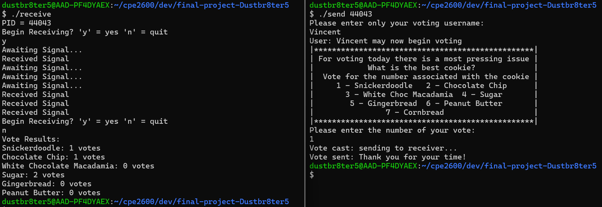

# CPE2600 Lab 13 Final Project
## Vincent Vassallo
## Section 111

## Purpose
The purpose of this project was to create a functional voting machine capable of taking in votes across multiple terminals
## Overview
This project utilizes 2 files ran across at minimum two terminals to send a vote that is then added to a running total that is reported once the program is ended. In order to send the vote and username from the send file to the receive file, the username and vote are put into a shared memory that is accessed by receive upon receiving a SIGUSR1 signal from send. In order to catch votes in succession, it utilized several threads each waiting for the signal, each one than catches a signal once they are sent. Precautions were made to make sure multiple threads do not catch the same signal.

## Instructions
1: Type make to get the needed executables

2: Run receive first and type y to begin waiting for signals

3: Run send using pid given by receive as a command argument

4: Follow send instructions

5: Repeat step 3 and 4 until receive prompts to wait again

6: either type y to wait for more signals or n to get results

Note: typing quit in as a username will end send

## Example

